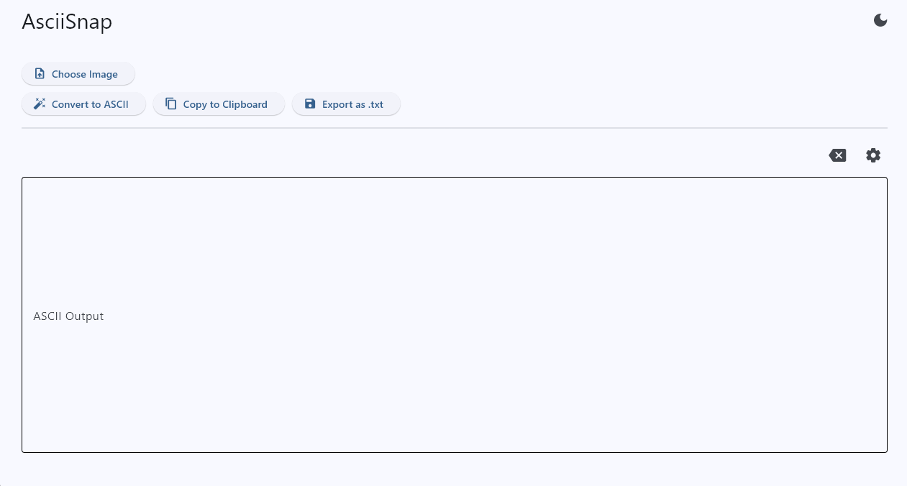

# 🖼️ AsciiSnap

A modern and customizable **Image to ASCII Art Generator** built using Python.  
Convert any image into beautiful ASCII art with live configuration controls and export options.

---

## 🚀 Preview

| CaseFlow |
| :---: | 
|  |

---

## ✨ Features

- 🖼️ Convert images to ASCII art instantly
- ⚙️ Fully customizable settings:
  - Columns (resolution control)
  - Width ratio adjustment
  - Custom ASCII characters
  - Front & background colors
  - Enhance image option
  - Monochrome mode
- 📋 Copy ASCII output to clipboard
- 💾 Export ASCII art as `.txt` file
- 🌙 Dark / ☀️ Light theme support
- 🎨 Clean and responsive UI
- 📁 File picker for image upload

---

## 🧠 Why this project?

This project was created to:

- Experiment with ASCII art generation techniques
- Build a fun and creative developer tool

---

## 🛠️ Tech Stack

- Python 🐍
- Flet (UI Framework)
- ascii-magic (ASCII generation library)

---

## 📦 Installation

```bash
# Clone repository
git clone https://github.com/arihant0907/Python_projects.git
cd asciisnap

# Install dependencies
pip install flet ascii-magic

python main.py
```

## 👨‍💻 Author
**Arihant**
*Python Developer*
