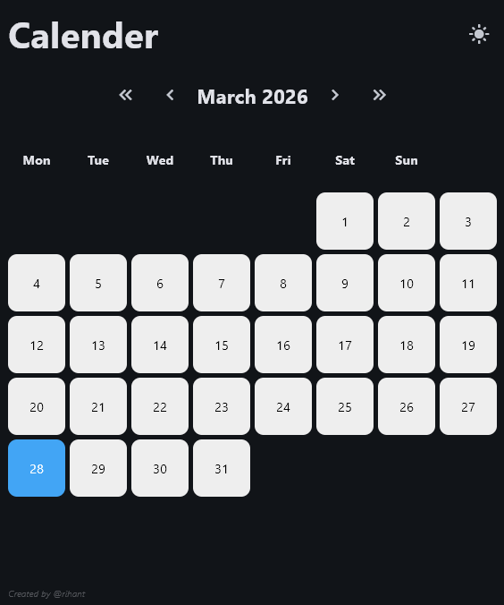

# 🌊 Calender

A lightweight Calender built with **Python** and **Flet (v0.80.0)**. This app features a cross platform support with any oprating system with Adaptve UI engine.

---

## ✨ Key Features

* **Navigations:**  '<<' and '>>' for year navigation and '<' and '>' for month navigation.
* **Adaptive Themes:** Toggle between **Dark Mode** and **Light Mode** instantly.
* **Clean Architecture:** Responsive layout that works on Desktop and Mobile windows.

## 🚀 Getting Started

### Prerequisites

This project requires **Python 3.8+**. To ensure the UI renders correctly without deprecation errors, use Flet version `0.80.0`.

### Installation

1.  **Clone the repository:**
    ```bash
    git clone https://github.com/arihant0907/Python_projects.git
    cd task-manager-flet
    ```

2.  **Create a virtual environment (Optional but Recommended):**
    ```bash
    python -m venv venv
    source venv/bin/activate  # On Windows: venv\Scripts\activate
    ```

3.  **Install Flet:**
    ```bash
    pip install flet==0.80.0
    ```

### Run the App

```bash
python src/main.py
```

## 📸 Visuals

### App Screenshots
| Calender |
| :---: |
|  |

## 👨‍💻 Author

**Arihant**
*Software Developer | Flet Enthusiast*

If you found this Task Manager helpful, consider giving it a ⭐ on GitHub!

---
*Created with ❤️ using Python & Flet*

