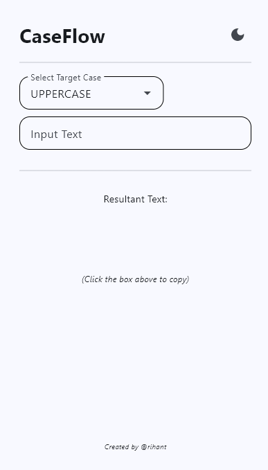

# 🔠 CaseFlow - Pro Text Case Converter

A modern, high-performance text transformation utility built with **Python** and **Flet**. CaseFlow eliminates the need for manual text reformatting by providing a **Live Preview** environment for all standard programming and writing conventions.

## 🚀 The Importance of CaseFlow
In software development, switching between naming conventions (like a database's `snake_case` and a JavaScript's `camelCase`) is a constant, time-consuming task. CaseFlow provides an **instant visual bridge**, allowing developers to convert strings in real-time without context-switching to online tools.

## ✨ Key Features
* **Live Transformation:** Text converts instantly as you type (no "Submit" button required).
* **7 Standard Cases:** Supports UPPER, lower, Title, snake, camel, Pascal, and kebab-case.
* **One-Tap Copy:** Every result has a dedicated clipboard button for fast workflow.
* **Dual Theme Engine:** Beautifully optimized for both High-Contrast Dark Mode and Clean White Mode.
* **Regex-Powered:** Uses robust Python Regular Expressions to handle complex string spacing.

  ## 📸 Preview
| City Carousel |
| :---: | 
|  |


## 📸 Installation & Usage

1. **Clone the Repo:**
   ```bash
   git clone [https://github.com/YOUR_USERNAME/caseflow-flet.git](https://github.com/YOUR_USERNAME/caseflow-flet.git)
   cd caseflow-flet
  '''

  ## 👨‍💻 Author
**Arihant**
*Python Developer*
