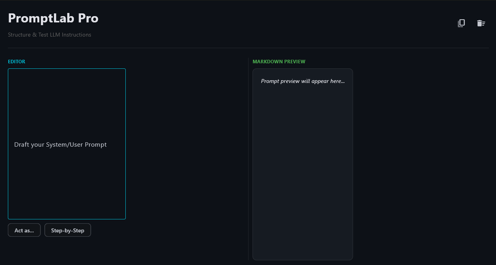

# 🚀 PromptLab Pro 

PromptLab Pro is a specialized developer tool designed for the "Agentic Era." It provides a high-performance environment to draft, structure, and preview complex LLM (Large Language Model) instructions before deployment.

## ✨ Why PromptLab Pro?
As prompt engineering becomes a core developer skill, the need for structured instruction design is critical. PromptLab Pro bridges the gap between raw text and model-ready input.

## 🛠️ Core Features
* **Live Markdown Preview:** Instantly see how your system instructions, tables, and code blocks render using the GitHub-flavored Markdown engine.
* **Variable Injection:** Use `{{handlebars}}` syntax to visualize placeholders for dynamic prompt injection.
* **One-Click Clipboard Sync:** Transfer your finalized prompt to any LLM interface (ChatGPT, Claude, Gemini) with zero formatting loss.
* **Quick-Action Chips:** Rapidly inject common prompt patterns like "Act as..." or "Step-by-Step" instructions.
* **Dark-Mode Optimized:** Built with a GitHub-inspired slate theme (`#0d1117`) to reduce eye strain during long engineering sessions.

## 📸 Preview
| PromptLab |
| :---: | 
|  |

## 🚀 Installation

### 1. Prerequisites
Ensure you have Python 3.8+ installed. You will need the `flet` library.

```bash
pip install flet

git clone https://github.com/arihant0907/Python_projects.git

cd Python_projects

cd PromptLab

python main.py
```

## 👨‍💻 Author
**Arihant**
*Python Developer*
