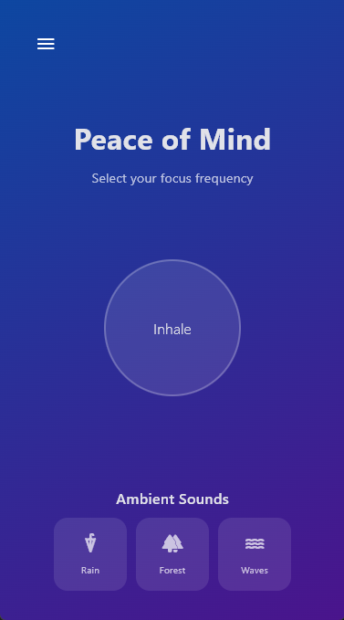

# 🧘 ZenSpace - Focus & Ambient Soundscape

A premium, creative wellness application built with **Python** and **Flet**. ZenSpace combines **Implicit Animations**, **Glassmorphic UI**, and **Gesture Control** to provide users with a calming, interactive breathing and soundscape experience.

---

## 🌟 Why This Project Matters

In a world of cluttered and noisy interfaces, **ZenSpace** serves as a demonstration of "Minimalist Functional Design." 

* **Mental Wellness:** Provides an immediate tool for stress reduction through guided breathing.
* **UX Excellence:** Showcases how to use **Implicit Animations** to create organic, human-like UI transitions (the breathing circle).
* **Modern Aesthetics:** Implements **Glassmorphism** (frosted glass effect) and **Linear Gradients** to meet 2026 design standards.
* **Cross-Platform Ready:** Built on the Flutter engine via Flet, making it ready for Desktop, Web, and Mobile from a single codebase.

## ✨ Key Features

* **Interactive Breathing Guide:** A smooth, animated circle that guides users through Inhale/Exhale cycles via tap gestures.
* **Dynamic Soundscape Grid:** Creative "Sound Chips" designed for ambient audio selection (Rain, Forest, Waves).
* **High-End Visuals:** Deep purple/blue gradients with blurred overlays for a high-contrast, focus-oriented look.
* **Theme Continuity:** Designed to look stunning in dark mode to reduce eye strain.

## 📸 App Preview

| Breathing Exercise (Active) |
| :---: | 
|  |

> **Note:** For the best GitHub profile, record a short GIF of the breathing animation and place it in the `assets/` folder.

## 🚀 Installation & Run

### Prerequisites

* **Python 3.9+**
* **Flet Library (v0.80.0)**

### Setup

1.  **Clone the Repository:**
    ```bash
    git clone https://github.com/arihant0907/Python_projects.git
    cd zenspace-flet
    ```

2.  **Install Dependencies:**
    ```bash
    pip install flet==0.80.0
    ```

3.  **Run the Application:**
    ```bash
    python src/main.py
    ```

## 🛠️ Built With

* [Python](https://www.python.org/) - The engine behind the logic.
* [Flet](https://flet.dev/) - Framework for fast, beautiful UI.
* **Flet Animations API** - Powering the breathing expansion logic.

## 👨‍💻 Author

**Arihant**
*Software Developer*

---
*Created with focus and intent. If this project inspired you, don't forget to ⭐ the repo!*
